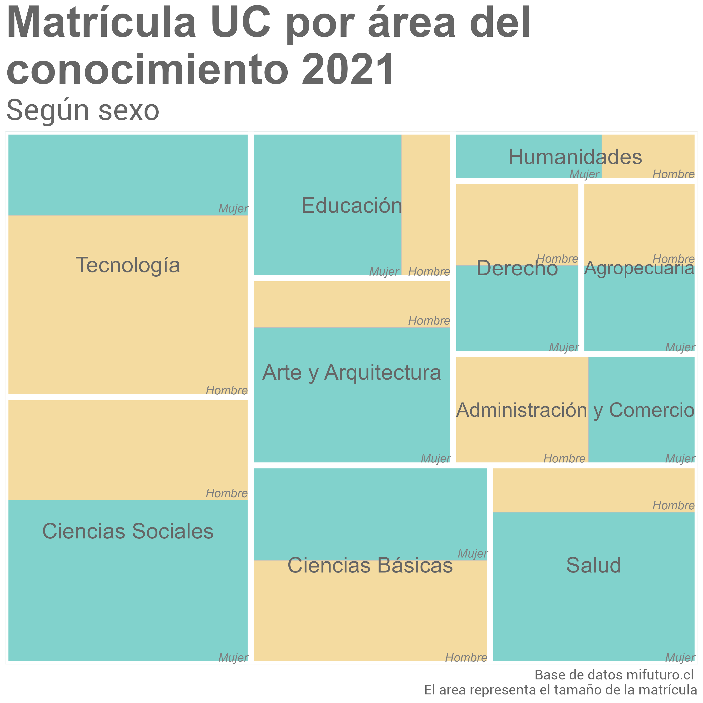
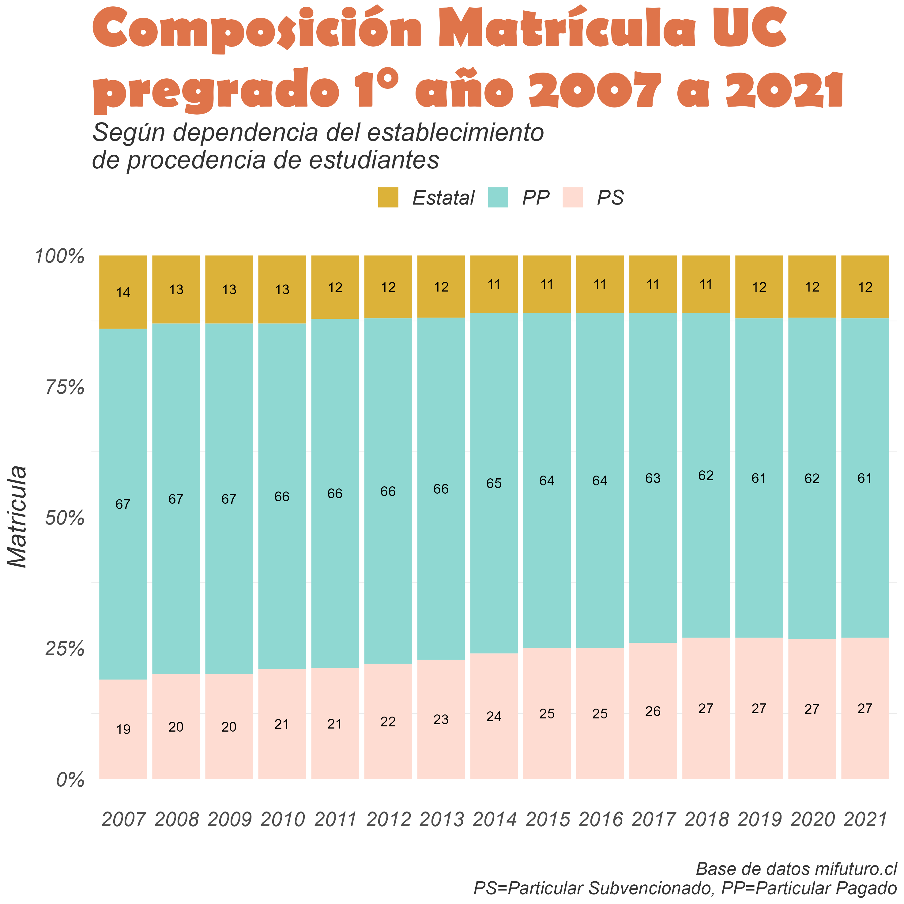

# 30DayChartChallenge2022

Participación en #30DayChartChallenge 2022 (ver: https://twitter.com/30DayChartChall).

- En la carpeta "R" encuentras los script de los gráficos subidos según día.

- En la carpeta "input" puedes encontrar las bases de datos, a menos que éstas sean públicas. De ser así en el script encontrarás un link a ellas.

- En la carpeta "output" encuentras las imágenes de los gráficos.

Equipo [DESUC](http://sociologia.uc.cl/desuc/quienes-somos-desuc/)

Nuestro blog [aquí](https://blog.desuc.cl/) 

### Día 1: Part-to-whole 

Este tipo de gráficos que se engloban en los "part-to-whole" permiten mostrar partes dentro de una variable. En este caso, se muestra la composición de la matrícula de pregrado de 1° año del año 2021 de la UC, considerando área del conocimiento, y sexo.

- Datos para la elaboración del gráfico disponibles en la página web de [Mi futuro](https://www.mifuturo.cl/bases-de-datos-de-matriculados)
- Código disponible [aquí](/R/01.part_to_whole.R)

### Día 3: Historical

En este día el objetivo era reflejar gráficos con datos históricos. Para este caso, seguimos trabajando con las bases del gráfico previo, y elegimos un gráfico de barras, porque además del dato histórico nos interesaba reflejar la composición de la matrícula y su cambio en el tiempo, respecto a la dependencia de procedencia de les estudiantes de la UC de pregrado.

- Datos para la elaboración del gráfico disponibles en la página web de [Mi futuro](https://www.mifuturo.cl/bases-de-datos-de-matriculados)
- Código disponible [aquí](/R/03.historical.R)

