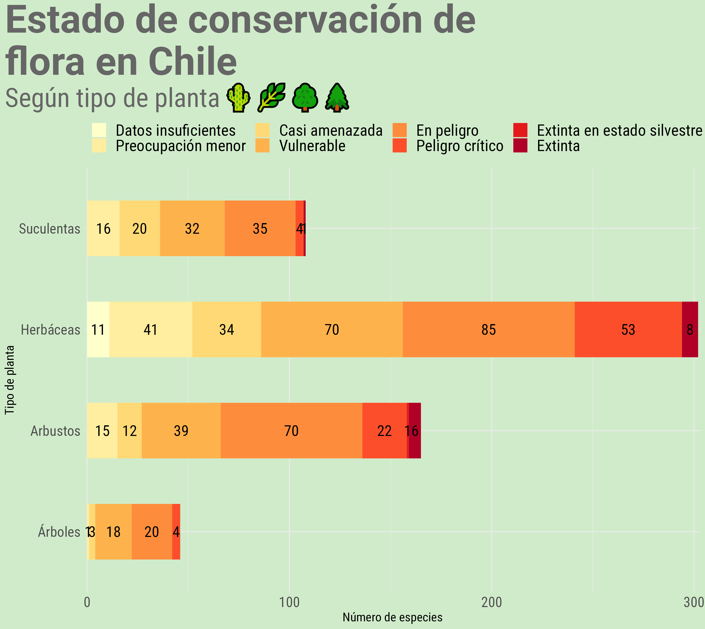
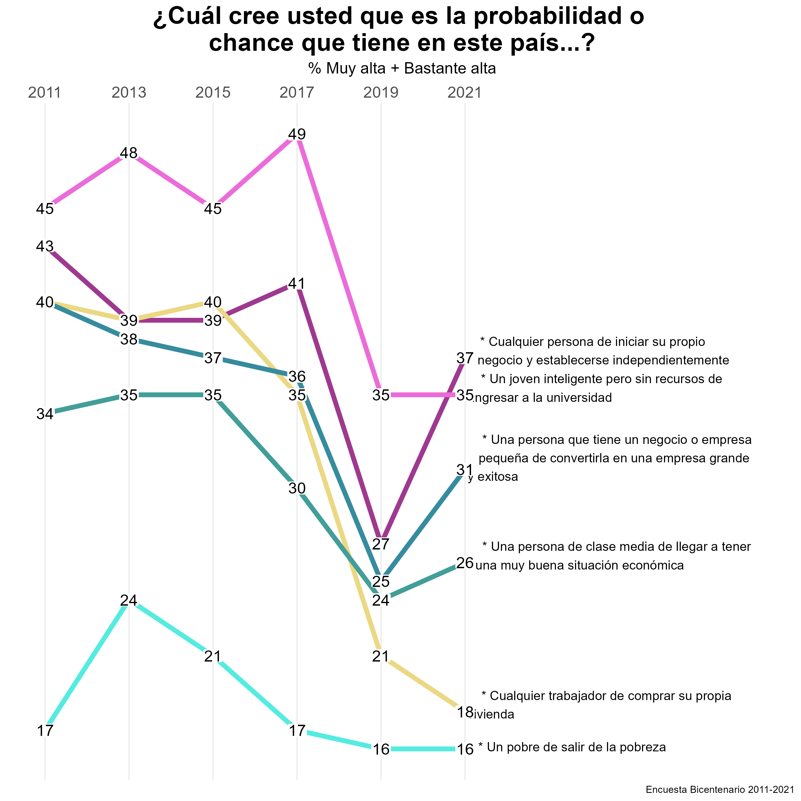
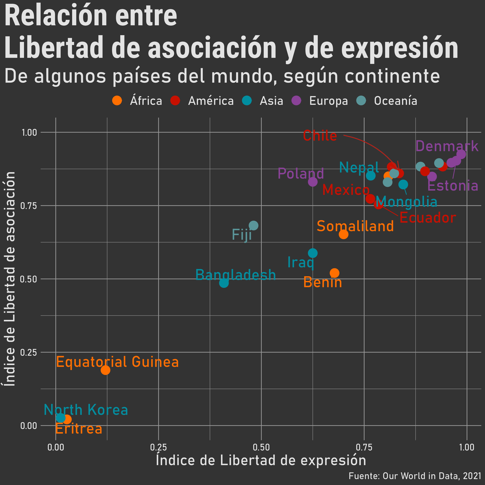

# 30DayChartChallenge2022

Participación en #30DayChartChallenge 2022 (ver: https://twitter.com/30DayChartChall).

- En la carpeta "R" encuentras los script de los gráficos subidos según día.

- En la carpeta "input" puedes encontrar las bases de datos, a menos que éstas sean públicas. De ser así en el script encontrarás un link a ellas.

- En la carpeta "output" encuentras las imágenes de los gráficos.

Equipo [DESUC](http://sociologia.uc.cl/desuc/quienes-somos-desuc/)

Nuestro blog [aquí](https://blog.desuc.cl/) 

### Día 1: Part-to-whole 

Este tipo de gráficos que se engloban en los "part-to-whole" permiten mostrar partes dentro de una variable. En este caso, se muestra la composición de la matrícula de pregrado de 1° año del año 2021 de la UC, considerando área del conocimiento, y sexo.

- Datos para la elaboración del gráfico disponibles en la página web de [Mi futuro](https://www.mifuturo.cl/bases-de-datos-de-matriculados)
- Código disponible [aquí](/R/01.part_to_whole.R)

### Día 3: Historical

En este día el objetivo era reflejar gráficos con datos históricos. Para este caso, seguimos trabajando con las bases del gráfico previo, y elegimos un gráfico de barras, porque además del dato histórico nos interesaba reflejar la composición de la matrícula y su cambio en el tiempo, respecto a la dependencia de procedencia de les estudiantes de la UC de pregrado.

- Datos para la elaboración del gráfico disponibles en la página web de [Mi futuro](https://www.mifuturo.cl/bases-de-datos-de-matriculados)
- Código disponible [aquí](/R/03.historical.R)

### Día 4: Flora

El día 4 era de la Flora. Y lo interpretamos como tal. Hicimos un gráfico de barras apiladas sobre tipos de plantas y estados de conservación.

- Datos para la elaboración del gráfico disponibles en la página web de [MMA](https://clasificacionespecies.mma.gob.cl/)
- Código disponible [aquí](/R/04.floral.R)

### Día 5: Slopes

El día 5 era Slopes. Los gráficos de pendientes son útiles para observar cambios entre un estado y otro. En este caso usamos una pregunta de la Encuesta Bicentenario UC para ver sus cambios en las distintas mediciones.

- Datos para la elaboración del gráfico disponibles en la carpeta input, y en la página de [Bicentenario UC](https://encuestabicentenario.uc.cl/resultados/)
- Código disponible [aquí](/R/05.slopes.R)

### Día 6: Our World in Data

El día 6 consistía en graficar comparaciones utilizando datos de Our World in Data. En el gráfico vemos la relación entre el índice de libertad de expresión y de asociación en distintos países del mundo según continente (dato curioso: para seleccionar los países utilizamos un muestreo aleatorio estratificado por continente con igual probabilidad de selección). Este tipo de gráficos son muy útiles para observar la relación entre variables numéricas o escalares.

- Datos para la elaboración del gráfico disponibles en la carpeta input, y en la página de [Our World in Data](https://ourworldindata.org/human-rights/)
- Código disponible [aquí](/R/06.OWID.R)

