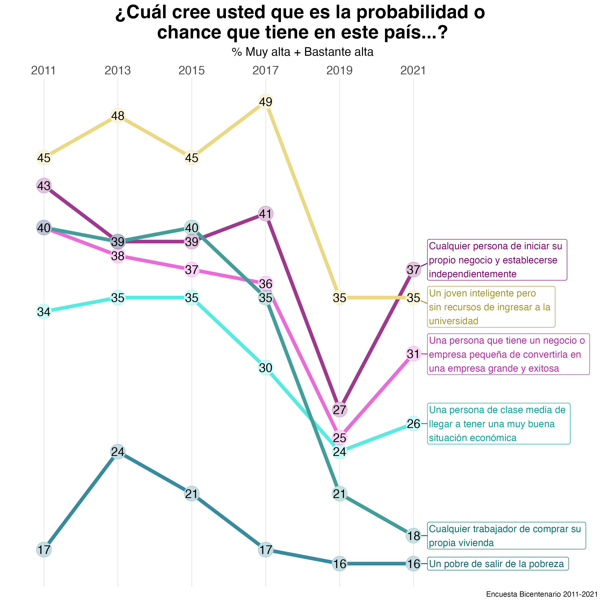
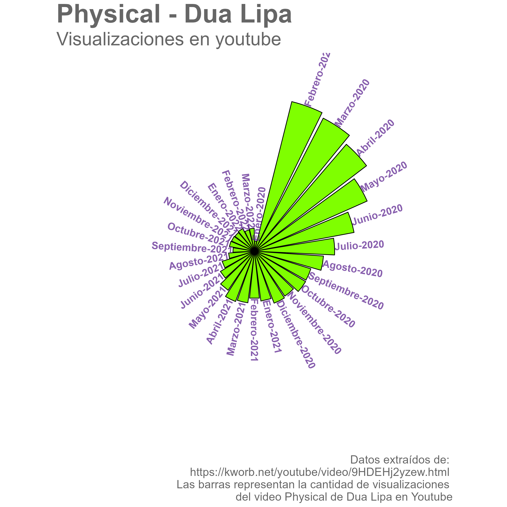

# 30DayChartChallenge2022

Participación en #30DayChartChallenge 2022 (ver: https://twitter.com/30DayChartChall).

- En la carpeta "R" encuentras los script de los gráficos subidos según día.

- En la carpeta "input" puedes encontrar las bases de datos, a menos que éstas sean públicas. De ser así en el script encontrarás un link a ellas.

- En la carpeta "output" encuentras las imágenes de los gráficos.

Equipo [DESUC](http://sociologia.uc.cl/desuc/quienes-somos-desuc/)

Nuestro blog [aquí](https://blog.desuc.cl/) 

### Día 1: Part-to-whole 

Este tipo de gráficos que se engloban en los "part-to-whole" permiten mostrar partes dentro de una variable. En este caso, se muestra la composición de la matrícula de pregrado de 1° año del año 2021 de la UC, considerando área del conocimiento, y sexo.

- Datos para la elaboración del gráfico disponibles en la página web de [Mi futuro](https://www.mifuturo.cl/bases-de-datos-de-matriculados)
- Código disponible [aquí](/R/01.part_to_whole.R)

### Día 3: Historical

En este día el objetivo era reflejar gráficos con datos históricos. Para este caso, seguimos trabajando con las bases del gráfico previo, y elegimos un gráfico de barras, porque además del dato histórico nos interesaba reflejar la composición de la matrícula y su cambio en el tiempo, respecto a la dependencia de procedencia de les estudiantes de la UC de pregrado.

- Datos para la elaboración del gráfico disponibles en la página web de [Mi futuro](https://www.mifuturo.cl/bases-de-datos-de-matriculados)
- Código disponible [aquí](/R/03.historical.R)

### Día 4: Flora

El día 4 era de la Flora. Y lo interpretamos como tal. Hicimos un gráfico de barras apiladas sobre tipos de plantas y estados de conservación.

- Datos para la elaboración del gráfico disponibles en la página web de [MMA](https://clasificacionespecies.mma.gob.cl/)
- Código disponible [aquí](/R/04.floral.R)

### Día 5: Slopes

El día 5 era Slopes. Los gráficos de pendientes son útiles para observar cambios entre un estado y otro. En este caso usamos una pregunta de la Encuesta Bicentenario UC para ver sus cambios en las distintas mediciones.

- Datos para la elaboración del gráfico disponibles en la carpeta input, y en la página de [Bicentenario UC](https://encuestabicentenario.uc.cl/resultados/)
- Código disponible [aquí](/R/05.slopes.R)

### Día 6: Our World in Data

El día 6 consistía en graficar comparaciones utilizando datos de Our World in Data. En el gráfico vemos la relación entre el índice de libertad de expresión y de asociación en distintos países del mundo según continente (dato curioso: para seleccionar los países utilizamos un muestreo aleatorio estratificado por continente con igual probabilidad de selección). Este tipo de gráficos son muy útiles para observar la relación entre variables numéricas o escalares.

- Datos para la elaboración del gráfico disponibles en la carpeta input, y en la página de [Our World in Data](https://ourworldindata.org/human-rights/)
- Código disponible [aquí](/R/06.OWID.R)

### Día 7: Physical

El día 7 comprendía gráficos asociados a Distribuciones siendo la temática "physical". Para ello se interpretó usando la canción de Dua Lipa y observando la distribución de las visualizaciones de la canción en Youtube.

- Datos para la elaboración del gráfico disponibles en la carpeta input.
- Código disponible [aquí](/R/07.physical.R)

### Día 8: Mountain

El día 8 comprendía gráficos asociados a Distribuciones siendo la temática "mountain". Para ello se realizó un gráfico musical.

- Datos para la elaboración del gráfico disponibles en la carpeta input.
- Código disponible [aquí](/R/08.mountain.R)

### Día 10: Experimental

El día 10 comprendía gráficos asociados a Distribuciones siendo la temática "experimental". Nuestro equipo lo reinterpretó desde una canción de Daddy Yankee, dada su eminente visita a nuestro país.

- Datos para la elaboración del gráfico disponibles en la carpeta input.
- Código disponible [aquí](/R/10. experiment.R)

### Día 12: The Economist theme

El día 12 comprendía realizar un gráfico siguiendo los [lineamientos gráficos][econ] de la revista The Economist. Creamos un gráfico similar a lo que en la guía llaman "Thermometer chart". 
Puede ser útil para comparar y marcar brechas entre segmentos. 
Utilizamos las mismas preguntas mostradas para el desafío de *Slopes*, diferenciando la respuesta de 2021 según sexo y nivel socioeconómico.

[econ]:https://design-system.economist.com/documents/CHARTstyleguide_20170505.pdf

- Datos para la elaboración del gráfico disponibles en la carpeta input.
- Código disponible [aquí](/R/12.theeconomist.R)

### Día 13: Correlación

El día 13 veremos cómo el número de actrices parte de un elenco en una película ha ido aumentando desde el 2000 en adelante, en relación al aumento de producciones dirigidos por mujeres. En el 2017 hubo una gran cantidad de películas dirigidas por mujeres, y por eso, pusimos algunos ejemplos para ver. En el 2021 [Titane](https://letterboxd.com/film/titane/) ganó la Palma de Oro en el Festival de Cannes, de la directora Julia Ducournau, y en los Oscar por dos años consecutivos han ganado mujeres en la mejor dirección: Cjloé Zhao con [Nomadland](https://letterboxd.com/film/nomadland/) y Jane Campion con [The Power of the Dog](https://letterboxd.com/film/the-power-of-the-dog/).

- Datos para la elaboración del gráfico disponibles en la carpeta input o en el siguiente [link](https://github.com/taubergm/HollywoodGenderData).
- Código disponible [aquí](/R/13.correlacion.R)

### Día 14: 3D

No somos big-fans de los gráficos 3D, pero sí que somos obedientes y el día de hoy nos corresponde un gráfico en esa modalidad. Acá les mostramos la relación entre comunas del Gran Santiago y el promedio de ingreso total por concepto de trabajo (según datos de Casen 2020). Señalamos con flechas las comunas donde está el máximo y el mínimo ¿pueden identificarlas?

Los gráficos 3D hay que utilizarlos con cuidado, pero en este caso se puede ver con claridad la gran diferencia en ingreso entre comunas de nuestra capital.

- Datos para la elaboración del gráfico disponibles en la carpeta input, y en la página de [Casen](http://observatorio.ministeriodesarrollosocial.gob.cl/encuesta-casen-en-pandemia-2020#:~:text=Los%20objetivos%20de%20Casen%20en,%2C%20vivienda%2C%20trabajo%20e%20ingresos/)
- Código disponible [aquí](/R/14.relations3D.R)

### Día 15: Multivariado

En la vida nos encantan muchas cosas, pero especialmente los fines de semana largos para maratonear viendo TV y el paquete de R ggplot, con su gran capacidad de mostrar de manera gráfica múltiples variables a la vez. Por eso, en el gráfico de hoy del tema "multivariado", mezclamos esas cosas que amamos y les mostramos el ranking semanal top 5 de Netflix con las siguientes variables: nombre del programa, país y posición en el ranking. (Anteriormente en el desafío también hemos graficado más de dos variables, ¿pueden identificar qué graficos son?)

- Datos para la elaboración del gráfico disponibles en la carpeta input, y en la página de los ranking de [Netflix](https://top10.netflix.com/)
- Código disponible [aquí](/R/15.multivariate.R)

### Día 17: Conexiones

La vida a veces nos da grandes coincidencias. Lorde se demora aproximadamente 4 años en sacar nuevos discos, lo cual está alineado con las elecciones presidenciales chilenas. Independiente de quién es electo, cabe preguntarse si Lorde es capaz de predecir cómo será ese periodo presidencial con el contenido de su música, después de todo, el periodo 2017-2021 hubo bastante Melodrama a nivel nacional e internacional, ¿cómo se definirá este periodo? ¿Leader of the New Regime o Fallen Fruit? 

- Los datos para la elaboración de este gráfico están en el siguiente [link](https://www.google.com/).
- Código disponible [aquí](/R/17.conexiones.R)

### Día 18: Datos de OECD

¿Los países que gastan más en educación obtienen mejores resultados en pruebas estandarizadas? Sabemos que es una pregunta de difícil respuesta, pero aquí les traemos datos para abrir el debate. En el gráfico se puede ver la relación entre % de gasto del PIB en educación y resultados de matemáticas de la prueba PISA en países OECD, para el año 2018 (últimos datos disponibles) Pareciera que no hay una relación tan clara, ¿qué opinan al respecto?

- Los datos para la elaboración de este gráfico están en la carpeta input, en este [link](https://data.oecd.org/eduresource/education-spending.htm/), y también en [este](https://data.oecd.org/pisa/mathematics-performance-pisa.htm/)
- Código disponible [aquí](/R/18.OECD.R)

