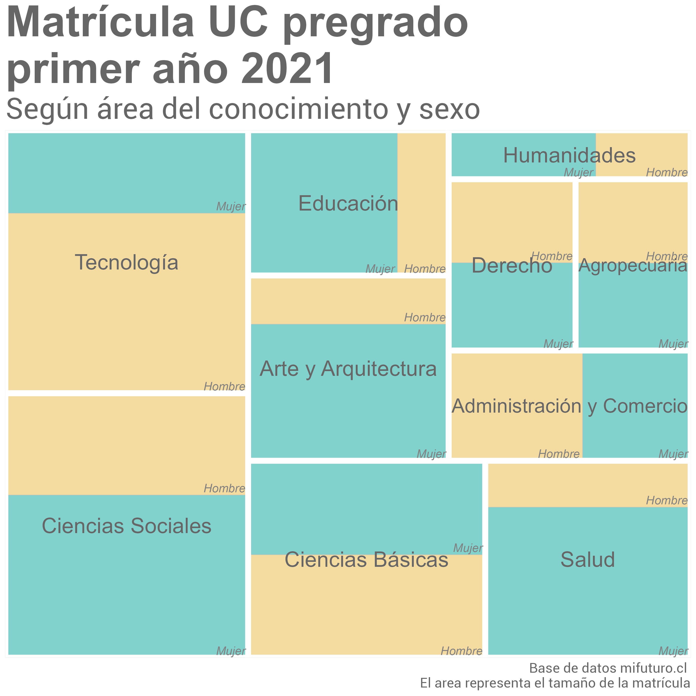

# 30DayChartChallenge2022

Participación en #30DayChartChallenge 2022 (ver: https://twitter.com/30DayChartChall).

- En la carpeta "R" encuentras los script de los gráficos subidos según día.

- En la carpeta "input" puedes encontrar las bases de datos, a menos que éstas sean públicas. De ser así en el script encontrarás un link a ellas.

- En la carpeta "output" encuentras las imágenes de los gráficos.

Equipo [DESUC](http://sociologia.uc.cl/desuc/quienes-somos-desuc/)

Nuestro blog [aquí](https://blog.desuc.cl/) 

### Día 1: Part-to-whole 

- Datos para la elaboración del gráfico disponibles en la página web de [Mi futuro](https://www.mifuturo.cl/bases-de-datos-de-matriculados)
- Código disponible [aquí](/R/part_to_whole.R)

